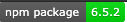

# My Project Name: Profeccional Readme.md Generarator

## Project Description
Using node.js and the inquired package, the app creates the file  by asking the user for a series of questions and generate a readme.md file.
## Table of Content
* [Installation](#installation) 
* [Tests](#Tests)
* [Questions](#Questions)
* [License](#License)   

## Installation

## Tests
run by > node index.js
## Questions
For any questions, please reach out to me:
    Find me in GitHub: josesanchezcapo | [My GitHub Profile](josesanchezcapo) | [Email Me](Follow me in Github to obtain my email.)
## Lincense
* MIT License
    